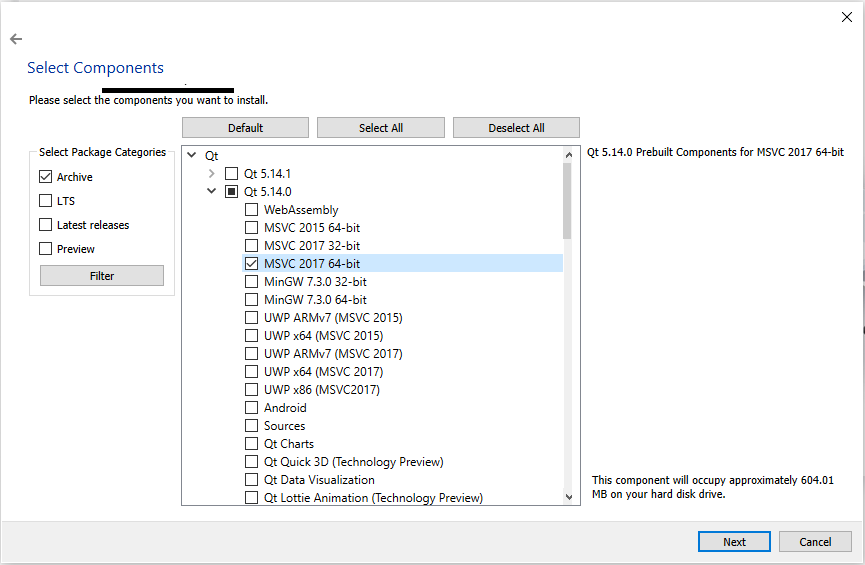
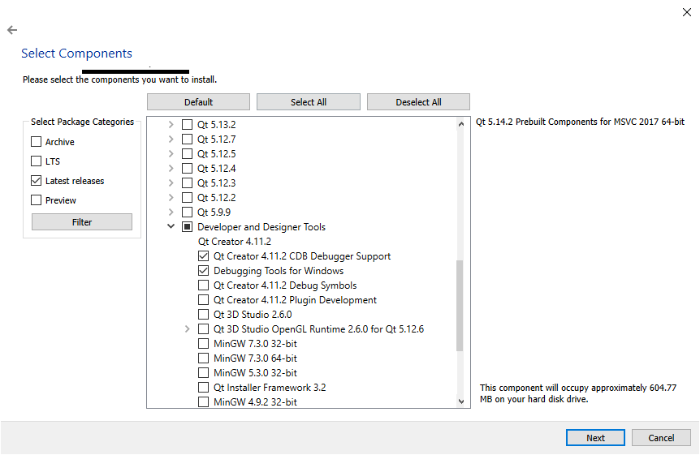

# Bio-MR
CS51 Design and implementation of a framework for bio-informed 3D user interaction

## Building the API
### 1. Install Qt
1. Download the Qt Online Installer from the bottom of this page: https://www.qt.io/download-open-source
2. Run the installer. You do not need to make an account.
3. Choose C:\Qt as the installation folder. This will guarantee the path length does not exceed the Windows limit.
4. Select "Archive" from the left menu options, then click "filter".
5. Select "Qt 5.14.0" > MSVC 2017 64-bit

6. Also select the following options.

