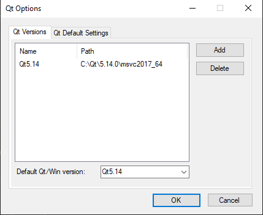
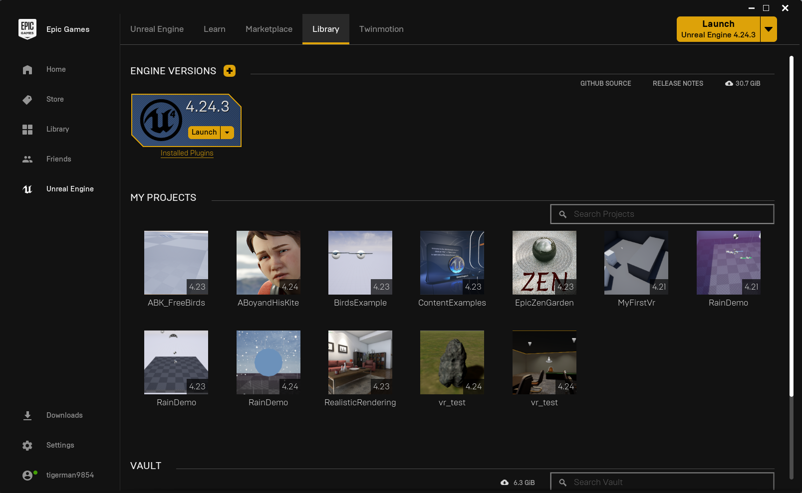
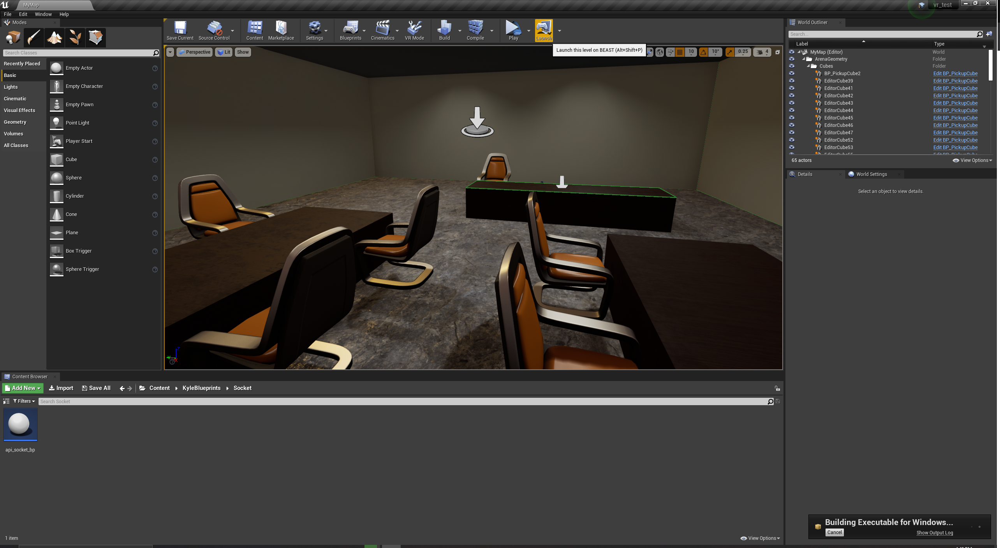

# Bio-MR
CS51 Design and implementation of a framework for bio-informed 3D user interaction

## Building the API

### 1. Install Qt
1. Download the Qt Online Installer from the bottom of this page: https://www.qt.io/download-open-source
2. Run the installer. Create a free account and verify your email.
3. Choose C:\Qt as the installation folder. This will guarantee the path length does not exceed the Windows limit.
4. Select "Latest Releases" from the left menu options.
5. Select "Qt 5.14.x" > "MSVC 2017 64-bit":

6. Also select the following options:

7. Allow all the selected packages to install.

### 2. Install QT VS Tools
1. Open Visual Studio 2019
2. Navigate to Extensions > Manage Extensions. Search for Qt.

3. Install the extension.
4. Restart your computer.

### 3. Set the Qt Path
1. Open Visual Studio 2019
2. Navigate to Extensions > Qt VS Tools > Qt Options.
3. Add a Qt Version so Visual Studio knows where to look for Qt files. IMPORTANT: If you plan to push to the repository, name your Qt version "Qt5.14". This will allow all developers to build the project without reconfiguring Qt.

### 4. Build
1. Clone the repository.
2. Open "Bio-MR/API/Bio-MR-API/Bio-MR-API.sln" using Visual Studio 2019.
3. Press F5 to build and run.

## Building the Unreal Engine 4 Scene

### 1. Install UE4
1. Download the Epic Games Launcher: https://www.epicgames.com/store/en-US/download
2. Create an Epic Games account, verify your email address.
3. Start the Epic Games Launcher, select the Unreal Engine tab, the install UE4 4.23.3.

### 2. Run the project
1. Clone the repository.
2. Setup your VR headset using Oculus software or SteamVR.
3. Open "Bio-MR/UE4/vr_test.uproject" using Unreal Engine 4.
4. Launch the build using Alt+Shift+P or click the launch button. NOTE: The BioMR API needs to be running before the UE4 project is launched

