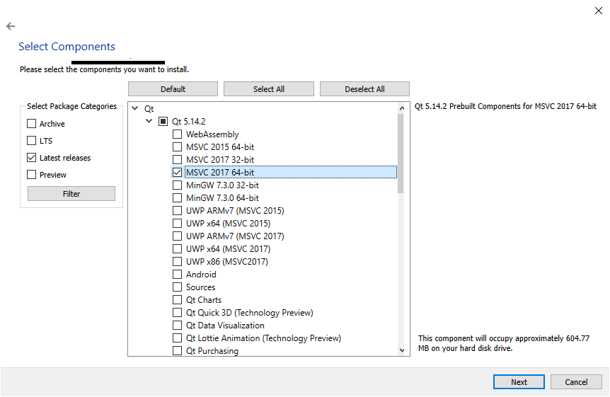

# Bio-MR
CS51 Design and implementation of a framework for bio-informed 3D user interaction

## Building the API

### 1. Install Qt
1. Download the Qt Online Installer from the bottom of this page: https://www.qt.io/download-open-source
2. Run the installer. You do not need to make an account.
3. Choose C:\Qt as the installation folder. This will guarantee the path length does not exceed the Windows limit.
4. Select "Archive" from the left menu options, then click "filter".
5. Select "Qt 5.14.0" > "MSVC 2017 64-bit".

6. Also select the following options.

7. Allow all the selected packages to install.

### 2. Install QT VS Tools
1. Open Visual Studio 2019
2. Navigate to Extensions > Manage Extensions. Search for Qt.

3. Install the extension.
4. Restart your computer.

### 3. Indicate a Qt Path
1. Open Visual Studio 2019
2. Navigate to Extensions > QT VS Tools > QT Options.
3. Add a Qt Version so Visual Studio knows where to look for Qt files. IMPORTANT: Make sure the name matches the one in the image, otherwise, you will need to make modifications to the VS project file to build properly.

### 4. Build
1. Clone the repository.
2. Open "Bio-MR/API/Bio-MR-API/Bio-MR-API.sln"
3. Press F5 to build and run!
